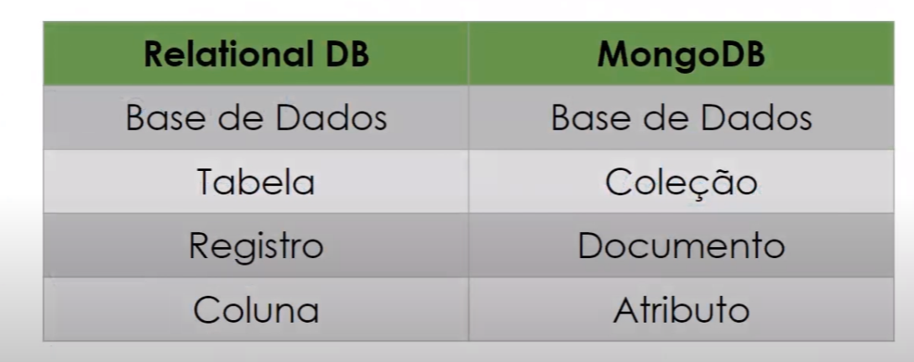
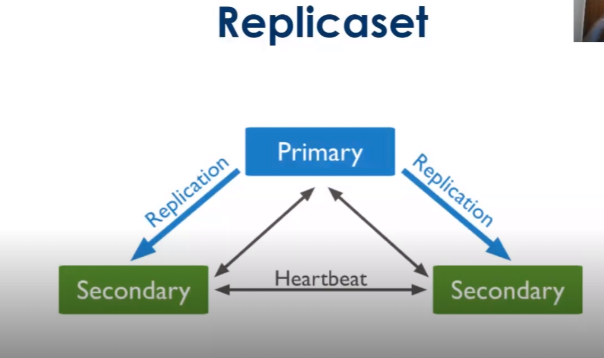
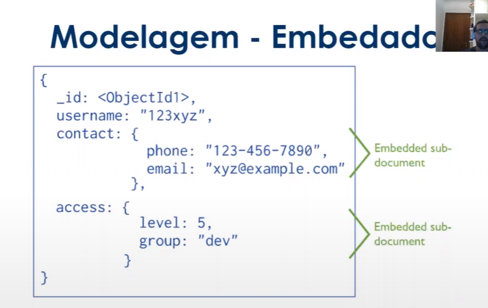
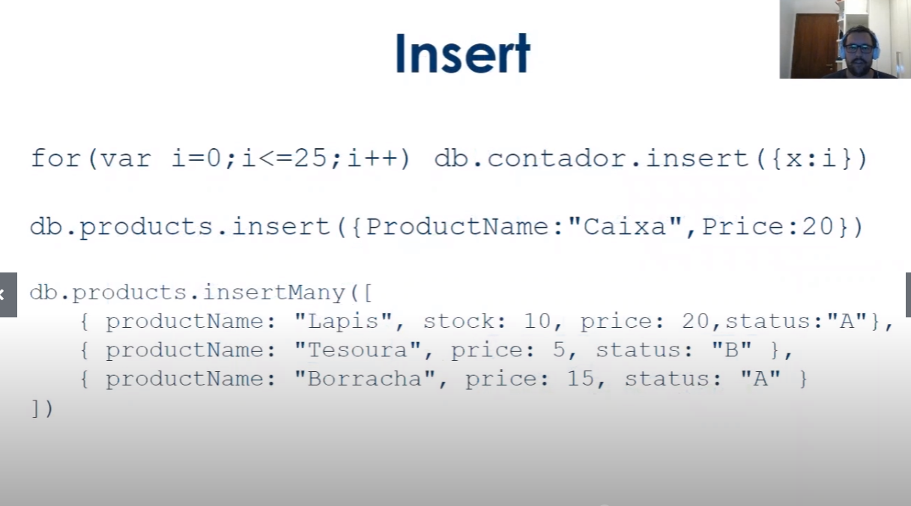
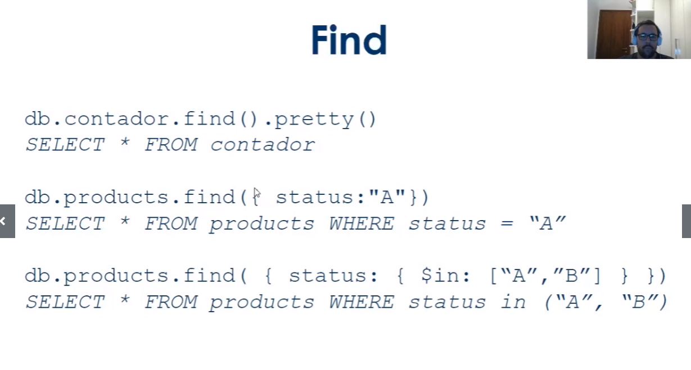

# Projeto dotNet com MongoDb 
	Projeto entregue como requerimento de conclusão do curso Avanade Fullstack Developer 

# API 
Application Programming Interface : Proporciona Integração entre sistemas 

# Bancos Relacionais : 
Tabelas muito relacionadas 

- SQl server
- PostGree 
- Mysql 
- Oracle 

# Bancos não Relacionais : 
Documentos , arquivos ..  

- Aumento da popularidade no século 21 por empresas como Google
- performance 
- Escalabilidade 
- Flexibilidade 
- Agilidade no desenvolvimento 

Tipos : 
- key/value redis 
- colunas  cassandra 
- documento model  mongodb 
- Gragos neo4j 

Site: db-engines.com  (ranking de uso desses dbs)

MongodB - Escrito em c++ opensorce multiplataforma e usa dados em formato BSON 



Standalone 

- atende pequenas aplicações 
- possui apenas um mongod em execução 

Para produção : 

- replicaset 
- conjunto de servidores com mongod que armazena os mesmos dados 
- redundancia e disponibilidade 
- tolerância a falhas 
- deploys podem ser configurados para aumetar a capacidade de leitura 
  
  
  
  Modelagem 


  


  


  


  MongoDBCompass :  

  para realizar querying e avaliar schemas e aggregations 

  MongoDb Atlas : 

  - tem o mongo stitch tipo serverless em node 
  - dá para trabalhar o charts , cria daschboars 
  - tem command line tools 
  - projeto -> cluster ->user -> database 

- dotnet new api -n Api 
- 

  


# dotnet-mongo

Exemplo de aplicação .net core com mongodb.

Para teste:

https://localhost:5001/infectado

```json
{
	"dataNascimento": "1990-03-01",
	"sexo": "M",
	"latitude": -23.5630994,
	"longitude": -46.6565712
}
```
OBS: é preciso ter configurar o acesso ao banco no appsettings.

Links Uteis:

- .net core - https://dotnet.microsoft.com/download

- visual code - https://code.visualstudio.com/download

- postman - https://www.postman.com/downloads/

- mongo atlas - https://www.mongodb.com/cloud/atlas/register


-----------------------------------------------

Referências:

https://docs.mongodb.com/

https://docs.mongodb.com/manual/

https://docs.mongodb.com/ecosystem/drivers/csharp/

https://docs.atlas.mongodb.com/
